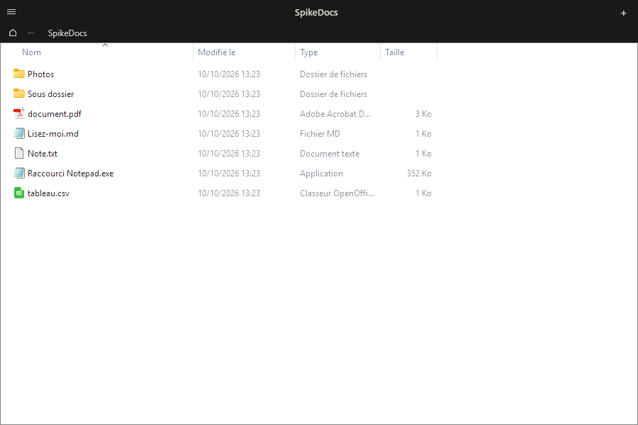

# Parité du portail avec l'Explorateur Windows

Feuille de route de la naultinus navigation (voir [FOLDER_PORTAL.md](FOLDER_PORTAL.md)).
Objectif : afficher et manipuler le contenu d'un dossier **comme l'Explorateur Windows**, avec le
jeu de fonctions attendu d'un portail de dossier.

## Propriété intellectuelle — règle du projet

Le modèle visé est un logiciel propriétaire, dont le contrat interdit notamment la décompilation.
Ce projet applique donc une règle stricte :

- **aucune ligne de code** du modèle n'est copiée ni adaptée ;
- aucune ressource (icône, image, son), aucun texte d'interface et aucun identifiant interne de ses
  binaires ne sont versés dans ce dépôt public ;
- la liste de ce document décrit un **comportement observable à l'usage** ;
- toute l'implémentation repose sur des **API documentées par Microsoft** (Shell COM, Win32).

Autrement dit : la règle porte sur **ce qui entre dans le dépôt** — des idées de comportement,
jamais du code, des ressources, des textes d'interface ou des noms internes du produit de référence.

## Choix d'architecture : héberger la vue d'éléments du shell

Plutôt que de redessiner une grille WPF item par item, le portail héberge **la vue d'éléments du
shell elle-même** : `IExplorerBrowser` comme hôte, `IFolderView2` pour la piloter, et les objets
fournis par le shell pour les menus (`IContextMenu3`), le glisser-déposer (`IDropTarget`/
`IDropSource`) et les renommages (`IFileOperation`).

Ce que Windows fournit du même coup, et qu'il ne faudra plus entretenir :

| Domaine | Ce qui est gagné |
|---------|------------------|
| Rendu | icônes shell avec superpositions (raccourci, synchro cloud), vignettes réelles, polices et espacements système, thème clair/sombre |
| Vues | icônes, liste, détails, éléments sélectionnés — modes `SFVM_MODE`, et en-tête de colonnes triable |
| Tri | tous les colonnes propriétés (nom, type, taille, date de modification, date de création…), croissant/décroissant, regroupement |
| Souris | sélection au ruban, double-clic, clic droit avec le menu exact de l'Explorateur, redimensionnement des colonnes |
| Clavier | F2, Ctrl+A, Ctrl+C / X / V, Suppr, Maj+Suppr, Alt+Entrée, navigation aux flèches, saisie du début du nom |
| Fichiers | glisser-déposer entrant et sortant avec les vrais effets (copier / déplacer / créer un lien), renommage en place, corbeille, annulation shell |
| Cible | dossiers locaux, chemins réseau, cibles de recherche, éléments d'espace de noms non filesystem |
| État | mémorisation par dossier du mode de vue, de la taille d'icônes et du tri (sac à dos de vue du shell) |

### Les quatre contraintes à lever

1. **Transparence.** Une fenêtre WPF avec `AllowsTransparency="True"` est une fenêtre *layered* :
   elle ne composite pas le contenu d'un `HwndHost`. La fenêtre de portail doit donc passer en
   rendu opaque, les coins arrondis et le fond restant assurés par le DWM
   (`WindowBackdrop` le fait déjà sur Windows 11). Les autres naultinus gardent leur transparence.
2. **Focus.** La vue shell n'est pilotable au clavier que si la fenêtre est réellement activée.
   Il faut donc cesser de remonter la naultinus au premier plan au clic
   (`WindowSinker.OnPreviewMouseDown`) : le hook `WM_WINDOWPOSCHANGING` qui force `SWP_NOZORDER`
   suffit à la maintenir en arrière-plan **tout en lui donnant le focus**.
3. **Site COM et messages clavier.** `IExplorerBrowser` attend un site (`IOleWindow`,
   `IInputSite`) et la traduction des messages de clavier et de raccourcis depuis la boucle de
   messages WPF (`HwndSource.AddHook`, `IInputScope::IsInputKey` / `TranslateAccelerator`).
   Sans cela : plus de flèches, plus de F2, plus de saisie du début du nom. **C'est l'essentiel du
   travail d'interop, et le premier spike à valider.**
4. **Redimensionnement et DPI.** Appeler `IExplorerBrowser::OnSizing` sur `WM_SIZE` et gérer le
   DPI par fenêtre (`GetWindowDpiAwarenessContext`) : la vue shell est respectueuse du DPI, le
   conteneur doit l'être aussi.

### Ce que l'on garde à notre charge

Racine du portail, historique de navigation, identité et position de la naultinus, onglets,
couleurs de l'en-tête, dispositions. Le mode de vue, la taille d'icônes et le tri par dossier
visité sont **délégués au shell** : pas de magasin à inventer ni à migrer.

## Critères d'acceptation

Un portail est « comparable à l'Explorateur » quand tout ce qui suit fonctionne, sans jamais
quitter la naultinus.

**Cible**

- [ ] dossier local, chemin réseau, cible de recherche
- [ ] création par tracé, par menu, et par glisser-déposer d'un dossier sur le bureau
- [ ] modification du dossier racine sans recréer la naultinus
- [ ] suppression de la naultinus **sans** supprimer le dossier
- [ ] masquage de portails donnés, et héritage de la racine par les portails d'un même onglet

**Navigation**

- [ ] entrer dans un sous-dossier, remonter, aller à la racine (raccourci clavier dédié)
- [ ] pile d'historique de retour, conservée entre deux exécutions, par naultinus
- [ ] titre de la naultinus = nom du dossier réellement affiché
- [ ] ouverture du dossier affiché dans l'Explorateur (double-clic sur le vide)
- [ ] ouverture du dossier racine du portail (double-clic avec Ctrl sur l'en-tête ou le vide)

**Vue**

- [ ] modes icônes, liste, détails, éléments — avec en-tête de colonnes masquable
- [ ] taille d'icônes réglable par portail (molette avec Ctrl), par défaut alignée sur la taille
      des icônes du bureau
- [ ] tri par nom, type, taille, date de modification, date de création, croissant ou décroissant
- [ ] mémorisation du mode, de la taille et du tri **pour chaque dossier visité**
- [ ] pas de réordonnancement manuel des éléments dans un portail (le tri fait foi)
- [ ] superpositions d'icônes affichées, avec options pour masquer celles de synchro et la flèche
      de raccourci

**Opérations sur les fichiers**

- [ ] glisser depuis et vers l'Explorateur et le bureau, avec Ctrl / Maj / Alt pour copier,
      déplacer, créer un lien
- [ ] dépôt sur un sous-dossier affiché = dépôt **dans** ce sous-dossier
- [ ] copier / couper / coller, y compris en provenance et à destination de l'Explorateur
- [ ] renommage en place, création de dossier et de fichier, mise à la corbeille avec confirmation
- [ ] menu contextuel de l'Explorateur sur les éléments **et** sur le vide (dont le sous-menu
      « Nouveau »)
- [ ] fenêtre de propriétés (Alt+Entrée), infobulles du shell
- [ ] recherche et filtre dans le dossier, requête conservée

**Robustesse**

- [ ] rafraîchissement déclenché par les notifications de modification du shell, pas par
      ré-interrogation périodique du disque ; sélection et défilement conservés
- [ ] dossier supprimé, renommé, réseau déconnecté, droits manquants : message clair, pas de plantage
- [ ] DPI et multi-moniteur : aucune mise à l'échelle floue, aucun saut de position
- [ ] fonctions désactivables une par une (double-clic, sortie de glisser-déposer, dépôt, clic
      droit, clavier) pour les environnements gérés

## Plan de travail
| PR | Contenu | Risque |
|----|---------|--------|
| 1 | Spike : hôte `HwndHost` + `IExplorerBrowser` + site COM + traduction clavier, fenêtre du portail rendue opaque, focus sans remontée de Z-order | élevé — valide ou invalide l'architecture |
| 2 | Navigation : historique persisté par naultinus, remontée à la racine, titre = dossier affiché, ouverture dans l'Explorateur | faible |
| 3 | Pilotage de la vue : modes, taille d'icônes, tri et colonnes, délégation de l'état de vue au shell | moyen |
| 4 | Interactions : dépôt sur un sous-dossier, menu du vide, recherche et filtre, infobulles, propriétés | moyen |
| 5 | Finitions : cibles de recherche et chemins réseau, masquage des superpositions, bascules désactivables, messages d'erreur | faible |

La PR 1 est un passe ou casse : si le site COM et le clavier ne fonctionnent pas, on revient à un
rendu WPF « au plus près de l'Explorateur » (`ListView`/`GridView` pour les détails, panneau
virtualisé pour les icônes), au prix de la reprise en main du glisser-déposer, des menus et du
tri.

## État d'avancement — PR 1 (spike) : architecture validée

Écrit : `Helpers/Native/ShellBrowserNative.cs` (déclarations COM des API documentées) et
`View/ShellFolderViewHost.cs` (hôte `HwndHost` : fenêtre site, création de l'hôte de vue,
dimensionnement, navigation par PIDL, repli silencieux sur l'affichage WPF en cas d'échec).
Le portail monte l'hôte à la place de sa grille quand la variable d'environnement
`NAULTINUS_SHELLVIEW` vaut `1` ; il passe alors en fenêtre opaque, faute de quoi Windows n'affiche
pas le contenu hébergé.



Vérifié sur le poste Windows (Windows 11 24H2) avec un dossier de test : la vue s'affiche avec le
rendu de l'Explorateur (colonnes Nom / Modifié le / Type / Taille, icônes vraies du shell, tri),
elle suit le redimensionnement de la fenêtre, et l'arborescence des fenêtres est bien celle de
l'Explorateur :

```
NaultinusShellViewSite › ExplorerBrowserControl › SHELLDLL_DefView › DirectUIHWND
```

Le repli fonctionne aussi : quand la vue ne peut pas être créée, le portail garde son affichage WPF
et note la raison dans le journal de diagnostic.

Reste à juger à la main, ce que la mesure automatique ne couvre pas :

- [ ] double-clic, sélection, clic droit, glisser-déposer et renommage se comportent comme dans
      l'Explorateur
- [ ] le clavier entre dans la vue (flèches, `Entrée`, `F2`, `Suppr`, saisie du début du nom)
- [ ] la naultinus reste derrière les autres fenêtres malgré les clics dans la vue
- [ ] la navigation de la barre d'adresse et l'onglet pilotent bien la vue
- [ ] aucune fuite : ouvrir et fermer la naultinus une dizaine de fois ne laisse pas de fenêtre orpheline

Limites assumées du spike : pas de `IShellBrowser` parent (donc pas de `Tab`/`MAJ+Tab` entre la vue
et le reste de l'interface), mode de vue et colonnes non encore pilotés (`IFolderView2` = PR 3),
et fond opaque pour le corps du portail.

### Pièges rencontrés, à ne pas répéter

- L'interface est documentée dans **`shobjidl_core.h`**, avec `IID_IExplorerBrowser =
  {DFD3B6B5-C10C-4BE9-85F6-A66969F402F6}` et `CLSID_ExplorerBrowser =
  {71F96385-DDD6-48D3-A0C1-AE06E8B055FB}`. Les identifiants que l'on trouve dans les exemples
  anciens (`{C180B158-…}`, `{DF0F37D6-…}`) correspondent à une version abandonnée : ils ne sont pas
  enregistrés du tout et `CoCreateInstance` répond `REGDB_E_CLASSNOTREG (0x80040154)`.
- `Initialize` prend `(hwndParent, prc, pfs)` — pas de fournisseur de services. La version à trois
  arguments avec `IShellBrowser` est la vieille interface ; lui passer les mauvais paramètres vaut
  `E_INVALIDARG`.
- Les indicateurs de `BrowseToIDList` sont les `SBSP_*` de `shobjidl.h`, dont **`SBSP_ABSOLUTE = 0`**.
  Les `SBSPF_*` (0x10, 0x20…) viennent de la même interface abandonnée et renvoient `E_INVALIDARG`.
- L'ordre des méthodes de l'interface est celui de l'en-tête, pas l'ordre alphabétique de la
  documentation : une déclaration incomplète ou décalée appelle la méthode voisine.
- `RegisterClassEx` doit être résolu en version **W** (`RegisterClassExW`) quand on marshalle un
  `LPWStr` : résolu en `A`, la classe est enregistrée sous le nom « N » et `CreateWindowEx`
  échoue en `ERROR_CANNOT_FIND_WND_CLASS (1407)`.
- `BuildWindowCore` ne doit **jamais** rendre un handle nul : WPF l'interprète comme une exception
  et ferme l'application. On rend une fenêtre vide et on garde l'affichage WPF.
- `Initialize` est appelé alors que la fenêtre hôte fait encore 1x1 (WPF dimensionne juste après) :
  c'est `SetRect`, déclenché par le message de dimensionnement, qui met la vue à l'heure.
- La capture d'écran de validation doit passer par `PrintWindow` avec `PW_RENDERFULLCONTENT` :
  une capture d'écran du contenu de l'écran est faussée par les fenêtres qui passent devant.